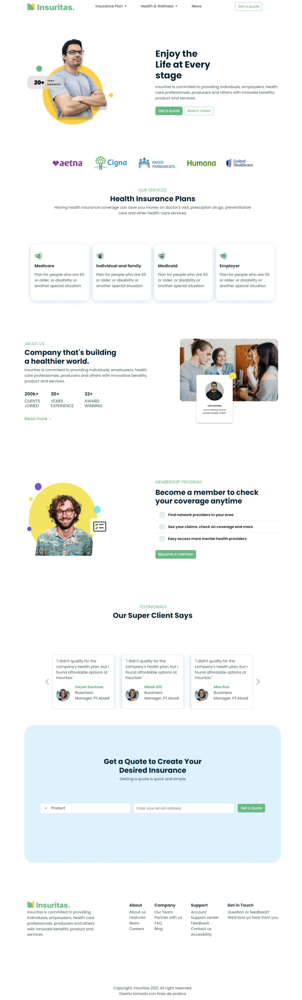
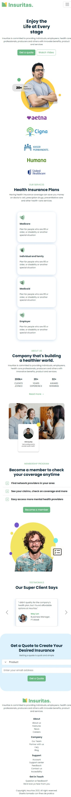

# Maquetar landingpage con Bootstrap

### Descripción:

Este proyecto es una práctica que refuerza conocimientos sobre maquetado de interfaces web con HTML, CSS, Bootstrap y diseño web responsive.

**Vista previa del proyecto:**

**Tamaño Desktop:**

**Visualización en tamaño Movil:**

### Recursos

* Fuente en [Google Fonts](https://fonts.google.com/)
* Diseño en [Pinterest](https://mx.pinterest.com/)
* Imagenes en [unsplash](https://unsplash.com/)